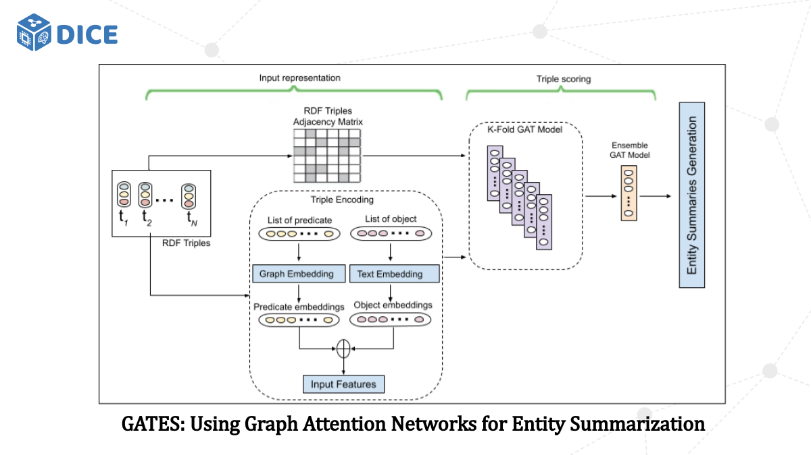

# GATES: Using Graph Attention Networks for Entity Summarization

This repository contains the implementation and dataset of our paper GATES: Using Graph Attention Networks for Entity Summarization.

<p align="center">

</p>
## Dataset

On this experiment, we used two datasets:
1. [ESBM (version 1.2)](https://github.com/nju-websoft/ESBM/tree/master/v1.2) that consists of 175 entities related to 150 entities from DBpedia and 25 entities from LinkedMDB.
2. FACES dataset.

## Pre-trained Knowledge Graph Embedding Models

GATES implements knowledge graph embedding and also provides pre-trained model for each model on ESBM benchmark dataset as follows:
* ComplEx
* ConEx
* DistMult

## Pre-trained Word Embedding Models 

GATES applies Glove and fastText as word embeddings.

### Glove
1. Download pre-trained model [glove.6B.zip](http://nlp.stanford.edu/data/glove.6B.zip)
2. Extract the zip file in data folder

### fastText
1. Download pre-trained model [wiki-news-300d-1M.vec.zip](https://dl.fbaipublicfiles.com/fasttext/vectors-english/wiki-news-300d-1M.vec.zip)
2. Extract the zip file and put the file on data folder

## Environment and Dependency

### Environment

* Ubuntu 10.04.2 LTS
* python 3.6+
* pytorch 1.7.0

### Dependencies

Our dependencies from external library that are required to run the model, you need to install them as follow:

```
conda create -n dice-gates python=3.6
conda activate dice-gates
pip install scipy==1.5.4
pip install numpy==1.19.2
pip install gensim==3.8.3
pip install nltk==3.5
pip install torch==1.7.0
pip install psutil==5.8.0
pip install SPARQLWrapper==1.8.5
pip install matplotlib==3.3.4
pip install rdflib==4.2.1
pip install tqdm
```
or

```
pip install -r requirements.txt
```

## Installation
```
git clone https://github.com/dice-group/GATES.git
```


## Usage
```
usage: main.py [-h] [--mode MODE] [--kge_model KGE_MODEL]
               [--loss_function LOSS_FUNCTION] [--ent_emb_dim ENT_EMB_DIM]
               [--pred_emb_dim PRED_EMB_DIM] [--hidden_layers HIDDEN_LAYERS]
               [--nheads NHEADS] [--lr LR] [--dropout DROPOUT]
               [--weight_decay WEIGHT_DECAY] [--regularization REGULARIZATION]
               [--save_every SAVE_EVERY] [--n_epoch N_EPOCH]
               [--word_emb_model WORD_EMB_MODEL]
               [--word_emb_calc WORD_EMB_CALC]
               [--use_epoch USE_EPOCH [USE_EPOCH ...]]
               [--concat_model CONCAT_MODEL]
               [--weighted_edges_method WEIGHTED_EDGES_METHOD]

GATES: Graph Attention Network for Entity Summarization

optional arguments:
  -h, --help            show this help message and exit
  --mode MODE           use which mode type: train/test/all
  --kge_model KGE_MODEL
                        use ComplEx/DistMult/ConEx
  --loss_function LOSS_FUNCTION
                        use which loss type: BCE/MSE
  --ent_emb_dim ENT_EMB_DIM
                        the embeddiing dimension of entity
  --pred_emb_dim PRED_EMB_DIM
                        the embeddiing dimension of predicate
  --hidden_layers HIDDEN_LAYERS
                        the number of hidden layers
  --nheads NHEADS       the number of heads attention
  --lr LR               use to define learning rate hyperparameter
  --dropout DROPOUT     use to define dropout hyperparameter
  --weight_decay WEIGHT_DECAY
                        use to define weight decay hyperparameter if the
                        regularization set to True
  --regularization REGULARIZATION
                        use to define regularization: True/False
  --save_every SAVE_EVERY
                        save model in every n epochs
  --n_epoch N_EPOCH     train model in total n epochs
  --word_emb_model WORD_EMB_MODEL
                        use which word embedding model: fasttext/Glove
  --word_emb_calc WORD_EMB_CALC
                        use which method to compute textual form: SUM/AVG
  --use_epoch USE_EPOCH [USE_EPOCH ...]
                        how many epochs to train the model
  --concat_model CONCAT_MODEL
                        use which concatenation model (1 or 2). In which, 1
                        refers to KGE + Word embedding, and 2 refers to KGE +
                        (KGE/Word embeddings) depends on the object value
  --weighted_edges_method WEIGHTED_EDGES_METHOD
                        use which apply the initialize weighted edges method:
                        tf-idf

```

### Training the model

```
python main.py --mode train --weighted_edges_method tf-idf
```

### Testing the model
```
python main.py --mode test --weighted_edges_method tf-idf
```

### Evaluation Result

Evaluation Method: F-Measure

| Model               | DBpedia                  || LMDB                   || FACES ||	
| ------------------- | ------------| ------------|------------|------------|-------|--------|
|                     | K=5         | K=10        | K=5        | K=10       | K=5   | K=10   |
| ESA                 | 0,332       | 0,532       | 0,353      | 0,435      | 0,153 | 0,261  |
| AutoSUM             | 0,372	     | 0,555       | 0,430      | 0,520      | 0,241 | 0,316  |
| DeepLENS            | 0,404       | **0,575**   | **0,469**      | 0,489      | 0,130 | 0,248  |
| GATES               | **0,423**   | 0,574   | 0,437  | **0,535**  |***0,254*** | **0.324** |

## Contact
If you have any feedback or suggestions, feel free to send me an email to asep.fajar.firmansyah@upb.de

## Cite
```
@inproceedings{DBLP:conf/kcap/FirmansyahMN21,
  author    = {Asep Fajar Firmansyah and
               Diego Moussallem and
               Axel{-}Cyrille Ngonga Ngomo},
  editor    = {Anna Lisa Gentile and
               Rafael Gon{\c{c}}alves},
  title     = {{GATES:} Using Graph Attention Networks for Entity Summarization},
  booktitle = {{K-CAP} '21: Knowledge Capture Conference, Virtual Event, USA, December
               2-3, 2021},
  pages     = {73--80},
  publisher = {{ACM}},
  year      = {2021},
  url       = {https://doi.org/10.1145/3460210.3493574},
  doi       = {10.1145/3460210.3493574},
  timestamp = {Thu, 25 Nov 2021 10:29:00 +0100},
  biburl    = {https://dblp.org/rec/conf/kcap/FirmansyahMN21.bib},
  bibsource = {dblp computer science bibliography, https://dblp.org}
}
```

## Contact
If you have any questions or feedbacks, feel free to contact us at asep.fajar.firmansyah@upb.de
